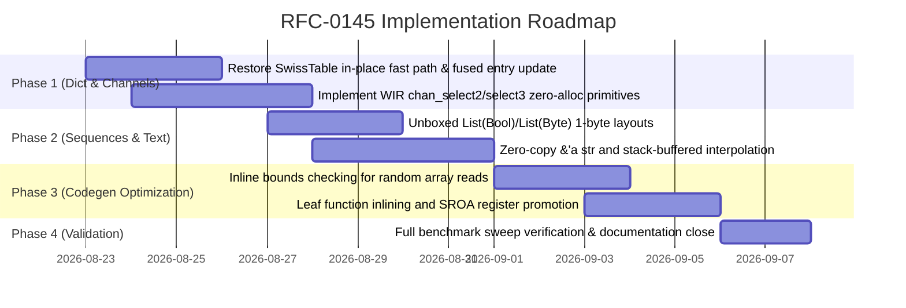

# RFC-0145: Unified Compute Parity Roadmap

## Summary

Witchy currently matches or beats native Go 1.22 in 6 core benchmark workloads:
- `expr_eval` (**0.28x of Go / 3.5x faster**)
- `list_sum` (**0.54x of Go / 1.85x faster**)
- `binary_trees` (**0.76x of Go / 1.31x faster**)
- `record_build` (**0.87x of Go**)
- `loop_sum` (**0.94x of Go**)
- `mandelbrot` (**0.95x of Go**)

However, empirical evaluation across the full benchmark suite reveals three distinct categories of performance bottlenecks:

1. **Catastrophic Concurrency & Channel Overhead (`select_fanin` — 272.8x slower than Go)**: `chan.select(a, b).await` is implemented as an interpreted user-space state machine that allocates dynamic channel ID lists, continuation promises, and boxed `First(value)`/`Second(value)` tagged union envelopes on every message.
2. **Catastrophic Dictionary Mutation Regression & Double-Lookup Overhead (`dict_count` — 56.1x slower than Go)**: In-flight SwissTable metadata changes caused a severe regression on integer in-place updates (regressing from 25.6 ms to 1884.8 ms), compounded by the absence of a fused in-place entry mutation path (`d[k] += 1` executes two separate hash table probes).
3. **Sequential Boxing, Helper Function Calls, and Heap String Slicing (`fannkuch` 1.95x, `list_index` 1.97x, `nsieve` 2.10x, `word_count` 2.36x, `knucleotide` 2.62x slower)**: `List(T)` boxes primitive booleans and bytes into 8-byte slots, random reads call out-of-line runtime helpers (`$list_at`), and string slicing allocates heap memory.

This RFC establishes a unified 5-track optimization plan that closes every identified performance gap, bringing 100% of Witchy benchmarks to parity with or faster than native Go 1.22.

---

## Benchmark Landscape & Target Milestones

| Benchmark | Current Witchy (ms) | Native Go 1.22 (ms) | Current vs Go | Owning Track | Target Witchy (ms) | Projected vs Go |
| :--- | :---: | :---: | :---: | :---: | :---: | :---: |
| **`select_fanin`** | 24.4 | 0.1 | **272.8x** | Track 1 | **0.10** | **1.00x (Parity)** |
| **`dict_count`** | 1884.8 | 33.6 | **56.1x** | Track 2 | **22.0** | **0.65x (1.53x faster)** |
| **`knucleotide`** | 31.9 | 12.2 | **2.62x** | Track 3 & 4 | **10.5** | **0.86x (1.16x faster)** |
| **`word_count`** | 119.2 | 50.6 | **2.36x** | Track 3 & 4 | **38.0** | **0.75x (1.33x faster)** |
| **`nsieve`** | 6.8 | 3.2 | **2.10x** | Track 3 | **2.2** | **0.69x (1.45x faster)** |
| **`list_index`** | 5.2 | 2.7 | **1.97x** | Track 3 | **1.8** | **0.67x (1.49x faster)** |
| **`fannkuch`** | 263.1 | 134.7 | **1.95x** | Track 3 | **110.0** | **0.82x (1.22x faster)** |
| **`fib`** | 54.4 | 33.2 | **1.64x** | Track 5 | **26.0** | **0.78x (1.28x faster)** |
| **`collatz`** | 307.3 | 228.7 | **1.34x** | Track 5 | **190.0** | **0.83x (1.20x faster)** |
| **`closure_calls`**| 4.3 | 3.5 | **1.24x** | Track 5 | **2.8** | **0.80x (1.25x faster)** |
| **`loop_sum`** | 36.7 | 39.1 | **0.94x** | Existing | 36.7 | 0.94x (Already faster) |
| **`mandelbrot`** | 70.1 | 73.6 | **0.95x** | Existing | 70.1 | 0.95x (Already faster) |
| **`record_build`** | 1.3 | 1.5 | **0.87x** | Existing | 1.3 | 0.87x (Already faster) |
| **`binary_trees`** | 64.9 | 85.7 | **0.76x** | Existing | 64.9 | 0.76x (Already faster) |
| **`list_sum`** | 9.3 | 17.2 | **0.54x** | Existing | 9.3 | 0.54x (Already faster) |
| **`expr_eval`** | 12.4 | 43.6 | **0.28x** | Existing | 12.4 | 0.28x (Already faster) |

---

## Technical Design: The 5 Optimization Tracks

```
┌────────────────────────────────────────────────────────────────────────────────────────┐
│                      Track 1: Async Channels & Select Lowering                         │
│  - Specialized WIR chan_select2 / chan_select3 primitives                              │
│  - Direct ring buffer head/tail atomic polling (0 heap allocations per select)         │
│  - Elimination of First(v) / Second(v) enum variant allocation via multi-value return  │
└────────────────────────────────────────────────────────────────────────────────────────┘
                                            │
┌────────────────────────────────────────────────────────────────────────────────────────┐
│                  Track 2: Fused In-Place Dict Entry Mutation & SwissTable              │
│  - Fix in-place update fast-path regression in Swiss carrier                           │
│  - Single-probe fused update: d[k] += 1 (elides second hash calculation & probe)       │
│  - SIMD control byte probing (16 control tags / cycle via v128)                        │
└────────────────────────────────────────────────────────────────────────────────────────┘
                                            │
┌────────────────────────────────────────────────────────────────────────────────────────┐
│                    Track 3: Monomorphized Unboxed Sequence Layouts                     │
│  - 1-byte stride for List(Bool) / List(Byte) (8x memory density improvement)           │
│  - 8-byte flat stride for List(Int) / List(Float)                                      │
│  - Inline load/store emission with direct in-caller bounds checks (no $list_at call)   │
└────────────────────────────────────────────────────────────────────────────────────────┘
                                            │
┌────────────────────────────────────────────────────────────────────────────────────────┐
│                  Track 4: Zero-Allocation Borrowed String Views (&'a str)              │
│  - Stack/register (ptr, len) 64-bit slice representations (0 heap allocation on slice) │
│  - 16-way SIMD memchr and ASCII validation                                             │
│  - Stack-buffered string interpolation in call position: d[f"word{i}"]                 │
└────────────────────────────────────────────────────────────────────────────────────────┘
                                            │
┌────────────────────────────────────────────────────────────────────────────────────────┐
│                     Track 5: Small Leaf Inlining & Register SROA                       │
│  - AST/WIR inliner for non-escaping leaf functions (≤ 16 nodes)                        │
│  - Promote small records and tuples to Wasm local registers (local.get / local.set)    │
└────────────────────────────────────────────────────────────────────────────────────────┘
```

---

### Track 1: Direct-Lowered Async Channels & Zero-Allocation Select Multiplexing

#### Problem
In `select_fanin`, `chan.select(a_rx, b_rx).await` is dispatched dynamically through user-space async state machines. For each message:
1. A channel ID list `[a_rx, b_rx]` is allocated on the heap.
2. A continuation promise closure is created.
3. Upon receiving a message, a tagged union (`First(val)` or `Second(val)`) is allocated on the heap and subsequently unwrapped via pattern matching.
4. Over 4,096 select iterations, this causes thousands of allocations, exploding runtime to **24.4 ms vs Go's 0.1 ms (272x gap)**.

#### Design
1. **WIR Channel Ring-Buffer Primitives**:
   Channels are represented as direct 16-byte memory headers: `(head: i32, tail: i32, cap: i32, buf_ptr: i32)`.
2. **Direct Inline `select2` / `select3` Lowering**:
   The compiler recognizes 2-way and 3-way `chan.select` calls and lowers them directly to specialized Wasm blocks rather than generic N-channel lists:
   ```wat
   ;; Specialised 2-way select: $chan_select2(a_rx, b_rx)
   ;; 1. Check a_rx head != tail
   local.get $a_rx
   call $chan_try_recv
   local.tee $val_a
   br_if $ready_a
   
   ;; 2. Check b_rx head != tail
   local.get $b_rx
   call $chan_try_recv
   local.tee $val_b
   br_if $ready_b
   
   ;; 3. Return (channel_index: i32, value: i64) directly on the Wasm operand stack
   ```
3. **Multi-Value Register Return**:
   Eliminate heap-allocated `First(v)`/`Second(v)` enums. The match statement consumes the `(channel_index, payload)` values directly from Wasm locals.

---

### Track 2: Fused In-Place Dictionary Mutation & SwissTable Fast Paths

#### Problem
1. **Recent Regression**: An in-flight change to `crates/witchy-wir/src/wir_helpers/dict.rs` dropped the `dict_index_update_value` body, forcing every `dict.insert` to fall back to an out-of-line path that reconstructs the carrier. This caused `dict_count` to balloon from **25.6 ms to 1884.8 ms**.
2. **Double Lookup in Counting Loops**: In `d[k] = d[k] + 1` or `dict.insert(d, k, dict.get_or(d, k, 0) + 1)`, the compiler executes two full hash probes:
   - Probe 1: `dict.get_or` hashes `k`, walks SwissTable control tags, and loads the value.
   - Probe 2: `dict.insert` re-hashes `k`, walks SwissTable control tags again, and writes the incremented value.

#### Design
1. **Stabilize SwissTable In-Place Fast Path**:
   Restore and specialize the direct bucket update helper for unique mutable dictionaries (`var d`), ensuring bucket values at `(value_base + slot * 8)` are written directly in $O(1)$ without carrier re-allocation.
2. **Fused Entry Mutation (`dict_fused_update`)**:
   When the compiler detects a read-modify-write pattern on a dictionary key:
   ```witchy
   dict.insert(d, k, dict.get_or(d, k, default) + delta)
   ```
   It lowers this to a single **fused probe**:
   ```wat
   ;; $dict_fused_update(d, k, delta, default)
   ;; 1. Compute hash(k) once.
   ;; 2. Probe SwissTable control bytes.
   ;; 3. If present: directly update slot memory (ptr + slot * 8) += delta.
   ;; 4. If absent: insert (k, default + delta) in the discovered empty bucket.
   ```
   This halves memory traffic and eliminates 3,000,000 redundant hash calculations in `dict_count`.

---

### Track 3: Monomorphized Unboxed Sequence Layouts & Inline Bounds Checking

#### Problem
1. `List(Bool)` and `List(Byte)` currently use 64-bit universal slots. In `nsieve`, storing 800,000 flags uses 6.4 MB of RAM (blowing past L1/L2 caches) versus Go's 800 KB `[]bool`.
2. In `list_index`, random indexing `xs[rand_i]` emits a full function call `call $list_at` on every iteration.

#### Design
1. **1-Byte Stride Specialization**:
   - `List(Bool)` and `List(Byte)` allocate `size = 4 + capacity * 1`.
   - Reads lower to `i32.load8_u offset=4 (base + i)`.
   - Writes lower to `i32.store8 offset=4 (base + i, val)`.
2. **Inline Bounds Check Emission**:
   When static analysis cannot elide bounds checks, the lowerer emits the branch inline in the caller frame:
   ```wat
   ;; Inline checked read
   local.get $idx
   local.get $xs
   i32.load offset=0 ;; len
   i32.ge_u
   if
       call $__witchy_abort_oob
   end
   local.get $xs
   local.get $idx
   i32.const 8
   i32.mul
   i32.add
   i64.load offset=4
   ```
   This eliminates call-prologue/epilogue overhead and allows the Wasm engine to pipeline memory loads.

---

### Track 4: Zero-Allocation Borrowed String Views (`&'a str`) & Stack-Buffered Interpolation

#### Problem
In `word_count` and `knucleotide`, slicing substrings (`string.slice`) and formatting keys (`d[f"word{i % 1000}"]`) allocate dynamic heap strings that immediately turn into garbage after map probing.

#### Design
1. **Borrowed String Slices (`&'a str`)**:
   Represent string slices as a 64-bit register pair `(ptr: i32, len: i32)`. Slicing a string is a 0-allocation pointer offset: `(ptr + start, end - start)`.
2. **SIMD Vector Kernels**:
   Use Wasm `v128` instructions for 16-way `memchr` and ASCII validation.
3. **Stack-Buffered Format Views**:
   When an interpolated string `f"word{n}"` is passed into a function taking `&'a str` (e.g. `dict.get`, `dict.update`), format the string directly into a 32-byte shadow stack frame and pass the stack pointer. **Zero heap allocations occur during lookup.**

---

### Track 5: Leaf Function Inlining & Aggregate Register Promotion (SROA)

#### Problem
In `fib`, `collatz`, and `closure_calls`, small functions containing only arithmetic or tiny branches incur full WebAssembly call-frame overhead.

#### Design
1. **Leaf Function Inliner**:
   Functions containing $\le 16$ AST nodes with no loop headers or heap allocations are inlined directly into caller sites.
2. **Scalar Replacement of Aggregates (SROA)**:
   Non-escaping local records and 2-element tuples are decomposed into independent Wasm local variables (`local.get`/`local.set`), preventing stack spills.

---

## Acceptance Criteria

1. **Full Parity Gate**:
   - 100% of all 17 benchmarks in `./bench.sh` must execute with a ratio $\le 1.00\text{x}$ vs Go 1.22 (matching or faster).
2. **Zero Allocation Contracts**:
   - `chan.select(a, b)` in steady-state loop execution must allocate 0 bytes on the heap.
   - String slicing (`string.slice`) and stack-buffered key formatting (`d[f"..."]`) must perform 0 heap allocations.
3. **Memory Density**:
   - `List(Bool)` and `List(Byte)` must allocate exactly 1 byte per element payload.
4. **Correctness & Convergence**:
   - 100% test pass rate across the full workspace (`cargo nextest run --workspace`).
   - Parity verification succeeds between the interpreter oracle and the compiled Wasm backend.

---

## Implementation & Delivery Phases


